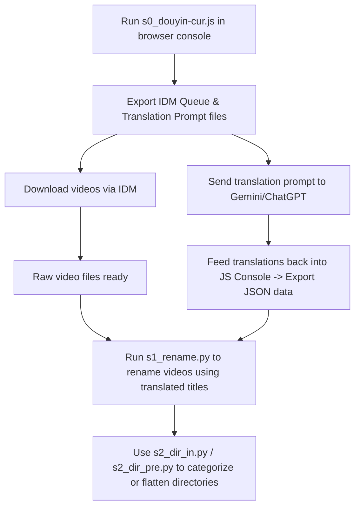

Below is the user guide (README) for your Douyin video data management and processing toolkit. This toolkit supports the entire pipeline from link extraction, batch downloading, title translation, to file renaming and directory organization.

---

# Douyin Video Management and Processing Pipeline

This toolkit provides an end-to-end workflow to extract video data from Douyin, translate video titles, batch download via IDM, automatically rename files, and organize them into corresponding folders.

## Workflow Overview



---

## Step-by-Step Guide

### Step 1: Data Collection & Download Queue Export (`s0_douyin-cur.js`)

The `s0_douyin-cur.js` file is a JavaScript snippet designed to run inside the browser's Developer Console (`F12`) on a Douyin user profile or series/mix playlist page.

#### How to use:
1. Navigate to a Douyin user profile or mix/series page in your browser.
2. Open **Developer Tools** (`F12` or `Ctrl+Shift+I`) -> Switch to the **Console** tab.
3. Copy the entire content of `s0_douyin-cur.js`, paste it into the Console, and press `Enter`.
4. Scroll down the page to let the script automatically intercept and record API (XHR) responses containing video metadata.
5. Execute the final command lines in the script to:
   - Export a `.txt` prompt file for translation (to be sent to AI models like Gemini/ChatGPT).
   - Export an IDM queue file (`idm_queue.txt`) to import into Internet Download Manager for batch downloading.
6. Once the translations are generated by the AI, run the `set_data` function in the Console to import the translated data and download the complete data file in `.json` format (e.g., `data_178.json`).

---

### Step 2: Batch File Renaming Based on Translations (`s1_rename.py`)

After downloading the videos and obtaining the JSON translation file, run the Python script `s1_rename.py` to automatically rename raw files (which usually have random strings or URL IDs as filenames) into your translated titles (e.g., Vietnamese, English).

#### Configuration and Execution:
Open `s1_rename.py` and adjust the paths at the end of the file to match your local setup:

```python
VD = Path(r'D:\vds\en')                 # Directory containing the downloaded videos
DA = Path(r"D:\vds\data_178.json")      # Path to the JSON data file exported in Step 1
RE = DA.with_name(f'{DA.name}_re.json') # Log file recording rename history

# The rename function parameters:
# rename(video_dir, json_file, log_file, extensions_list, search_key, target_name_key)
rename(VD, DA, RE, [".mp4", '.mp3', ".mkv", ".srt"], K.url, K.vi)
```

Run the script via terminal:
```bash
python s1_rename.py
```
*Note: The script automatically sanitizes and removes illegal Windows filename characters.*

---

### Step 3: Directory Organization & Management

To manage a large volume of video files, two directory management scripts are provided:

#### 1. Group files into subfolders (`s2_dir_in.py`)
This script scans the source directory and moves files into subdirectories based on filename prefixes (separated by `_` or `.`).

* **Usage:**
  Open the file and call `in_dir` with your target path:
  ```python
  # Groups .mp4, .mp3, .srt... files into subdirectories based on the prefix before "_" or "."
  in_dir(r'D:\vds\cn_1080x1920', False, *[".mp4", '.mp3', ".mkv", ".srt", '.json'])
  ```

#### 2. Flatten subfolders into the parent directory (`s2_dir_pre.py`)
This script performs the reverse operation: it scans subdirectories, moves all files back into the root parent folder, and optionally prepends the subfolder name to prevent naming collisions.

* **Usage:**
  ```python
  # Moves .srt and .mp3 files from subfolders back to the parent AP_exports directory
  pre_dir(r"D:\vds\AP_exports", 1, *['.en_US.srt', '.en_US.mp3'])
  ```

---

## System Requirements
* A modern browser with Developer Tools support (Chrome, Edge, Brave, etc.) to run the JavaScript snippet.
* **Python 3.x or higher** to run the file processing scripts.