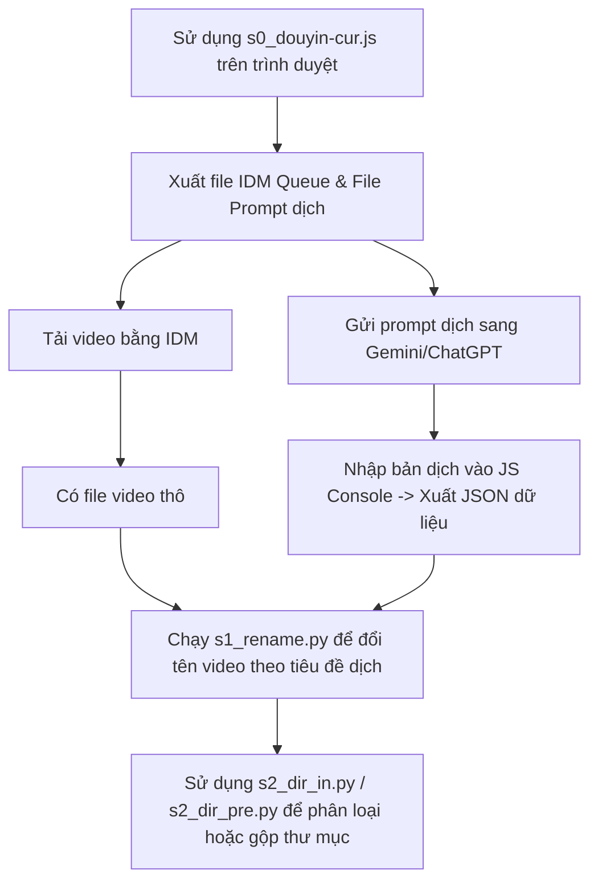

# Quy Trình Quản Lý Và Xử Lý Video Douyin

Bộ công cụ này cung cấp một quy trình khép kín giúp bạn lấy dữ liệu video từ Douyin, dịch thuật tiêu đề, tải xuống hàng loạt bằng IDM, đổi tên file tự động và sắp xếp tệp tin vào các thư mục tương ứng.

## Tổng quan quy trình (Workflow)



---

## Chi tiết các bước thực hiện

### Bước 1: Thu thập dữ liệu và xuất danh sách tải (s0_douyin-cur.js)

File `s0_douyin-cur.js` là một đoạn script JavaScript dùng để chạy trong môi trường Console của trình duyệt (F12) tại trang cá nhân hoặc trang tuyển tập (series) của Douyin.

#### Cách sử dụng:
1. Truy cập vào trang cá nhân Douyin hoặc trang danh sách phát (mix/series) trên trình duyệt.
2. Mở **Developer Tools** (F12 hoặc Ctrl+Shift+I) -> Chuyển sang tab **Console**.
3. Copy toàn bộ nội dung file `s0_douyin-cur.js` và dán vào Console rồi nhấn `Enter`.
4. Cuộn trang để script tự động bắt và lưu lại các yêu cầu API (XHR) chứa danh sách video.
5. Thực hiện các dòng lệnh cuối của file JS để:
   - Xuất file `.txt` chứa prompt dịch thuật (gửi cho các mô hình AI như Gemini).
   - Xuất file cấu hình IDM (`idm_queue.txt`) để nhập vào phần mềm Internet Download Manager và tải video hàng loạt.
6. Sau khi có bản dịch từ AI, sử dụng hàm `set_data` trong Console để nạp bản dịch vào và tải về file dữ liệu hoàn chỉnh dạng `.json` (ví dụ: `data_178.json`).

---

### Bước 2: Đổi tên file hàng loạt theo bản dịch (s1_rename.py)

Sau khi tải video về máy và có file JSON chứa thông tin dịch thuật, bạn dùng script Python `s1_rename.py` để tự động đổi tên các file thô (thường có tên là chuỗi ký tự ngẫu nhiên hoặc ID từ URL) thành tên tiếng Việt hoặc tiếng Anh đã dịch.

#### Cách cấu hình và chạy:
Mở file `s1_rename.py` và điều chỉnh các đường dẫn ở cuối file cho phù hợp với máy của bạn:

```python
VD = Path(r'D:\vds\en')             # Thư mục chứa video đã tải về
DA = Path(r"D:\vds\data_178.json")  # Đường dẫn tới file dữ liệu JSON đã xuất ở Bước 1
RE = DA.with_name(f'{DA.name}_re.json') # File log ghi lại lịch sử đổi tên

# Hàm rename nhận tham số đầu vào:
# rename(Thư_mục_video, File_JSON, File_Log, Danh_sách_định_dạng, Khóa_tìm_kiếm, Khóa_tên_mới)
rename(VD, DA, RE, [".mp4", '.mp3', ".mkv", ".srt"], K.url, K.vi)
```

Chạy file bằng lệnh:
```bash
python s1_rename.py
```
*Lưu ý: Script sẽ tự động lọc bỏ các ký tự không hợp lệ trong tên file của hệ điều hành Windows.*

---

### Bước 3: Phân loại hoặc hoàn tác thư mục lưu trữ

Để quản lý số lượng lớn video, bạn có thể sử dụng hai công cụ phân loại sau tùy theo nhu cầu.

#### 1. Gom nhóm file vào thư mục con (`s2_dir_in.py`)
Script này tự động quét các file trong thư mục nguồn và di chuyển chúng vào các thư mục con dựa trên phần tiền tố của tên file (tách biệt bởi dấu gạch dưới `_` hoặc dấu chấm `.`).

* **Cách dùng:**
  Mở file và gọi hàm `in_dir` với đường dẫn mong muốn:
  ```python
  # Phân loại các file .mp4, .mp3, .srt... vào thư mục con dựa trên ký tự đầu tiên trước dấu "_" hoặc "."
  in_dir(r'D:\vds\cn_1080x1920', False, *[".mp4", '.mp3', ".mkv", ".srt", '.json'])
  ```

#### 2. Đưa file từ thư mục con ra thư mục cha (`s2_dir_pre.py`)
Script này thực hiện quy trình ngược lại: quét các thư mục con bên trong thư mục nguồn, đưa toàn bộ file ra ngoài thư mục gốc và tùy chọn thêm tên thư mục cũ vào trước tên file để tránh trùng lặp.

* **Cách dùng:**
  ```python
  # Đưa các file srt và mp3 từ thư mục con ra ngoài thư mục AP_exports
  pre_dir(r"D:\vds\AP_exports", 1, *['.en_US.srt', '.en_US.mp3'])
  ```

---

## Yêu cầu hệ thống
* Trình duyệt hỗ trợ nhà phát triển (Chrome, Edge, Brave...) để chạy mã JavaScript.
* Phiên bản Python 3.x trở lên để chạy các mã script xử lý file.
